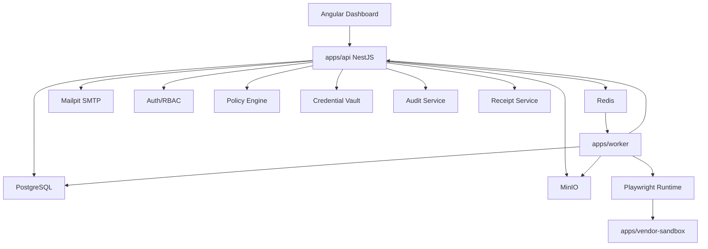

      # AgentPass Backend Implementation Plan

Generated: 2026-06-06

Project: `AegisWeb`

Product: `AgentPass`

Primary source: `docs/TECHNICAL_CONCEPTION.md`

## 1. Purpose

This document is the backend execution plan for AgentPass. It defines exactly how to create, test, and validate the backend step by step until the local MVP works end-to-end.

The backend must support this complete demo:

1. A user logs in.
2. The user creates an organization, agent, vendor, credentials, and policy.
3. The user starts a SaaS renewal workflow.
4. The API enqueues a workflow run.
5. The worker opens the local vendor sandbox with Playwright.
6. The worker uses vault-controlled credential injection.
7. The worker downloads an invoice and stores artifacts.
8. The policy engine detects a risky downgrade action.
9. The workflow pauses for approval.
10. A human approves in the dashboard.
11. The worker resumes and completes the action.
12. The backend generates audit events and a receipt.

The implementation must be local, free, testable, and reliable before any real vendor portals are used.

## 2. Backend Scope

Backend means:

- `apps/api`: NestJS control-plane API.
- `apps/worker`: BullMQ and Playwright workflow worker.
- `apps/vendor-sandbox`: local fake SaaS vendor portal used by worker tests and demos.
- `libs/domain`: shared enums, IDs, domain types, validation helpers.
- `libs/database`: Prisma schema, migrations, seed scripts, database utilities.
- `libs/policy-engine`: pure policy evaluation and risk scoring.
- `libs/vault`: encryption, secret payloads, redaction helpers.
- `libs/audit`: audit event hashing and receipt timeline helpers.
- `libs/browser-runtime`: Playwright action primitives and guardrails.
- `libs/testing`: factories, fixtures, test database helpers, fake adapters.

Frontend is not implemented in this plan, but backend endpoints must be designed for Angular consumption.

## 3. Locked Backend Stack

Use:

- Runtime: Node.js LTS.
- Language: TypeScript.
- API framework: NestJS.
- API style: REST.
- API documentation: OpenAPI.
- Database: PostgreSQL.
- ORM: Prisma.
- Queue: Redis plus BullMQ.
- Object storage: MinIO through S3-compatible SDK.
- Browser automation: Playwright.
- Local email: Mailpit.
- Password hashing: Argon2id.
- Token auth: JWT access token plus refresh token cookie.
- Unit test runner: Vitest or Jest.
- API integration tests: Nest testing utilities plus Supertest.
- E2E/runtime tests: Playwright and backend test helpers.

Decision:

- Prefer Jest if generated by NestJS/Nx defaults.
- Prefer Vitest only if the monorepo is configured around Vite/Nx Vitest from day one.
- Do not mix both in the first backend version.

## 4. Quality Bar

Every backend feature must satisfy:

- TypeScript strict mode passes.
- Lint passes.
- Unit tests pass.
- Integration tests pass for changed modules.
- No API endpoint returns raw secrets.
- Every mutating business operation emits an audit event.
- Every organization-scoped query is filtered by `organization_id`.
- Every protected route has auth and permission checks.
- Every workflow state transition is explicit and tested.
- Every worker action is idempotent or guarded against duplicate execution.
- Every failure path records a useful error and audit event.

## 5. Backend Architecture



## 6. Backend Module Dependency Rules

Use strict dependency direction:

```text
controllers -> application services -> domain libraries -> database/file/queue adapters
```

Allowed:

- API modules may import shared domain libraries.
- API modules may use Prisma through a database service.
- Worker may call internal API endpoints for sensitive operations.
- Worker may use pure domain libraries directly.
- Policy engine must stay pure and database-free.
- Vault crypto library must stay database-free.
- Audit hashing library must stay database-free.

Avoid:

- Controllers containing business rules.
- Prisma calls inside controllers.
- Worker reading decrypted credentials directly from the database.
- Policy engine depending on NestJS.
- Audit event updates or deletes.
- Circular module imports.

## 7. Implementation Phases

## Phase 0: Backend Foundation

Goal:

- Prepare the monorepo and local backend infrastructure.

Deliverables:

- Nx workspace or equivalent pnpm workspace.
- `apps/api`.
- `apps/worker`.
- `apps/vendor-sandbox`.
- `libs/domain`.
- `libs/database`.
- `libs/policy-engine`.
- `libs/vault`.
- `libs/audit`.
- `libs/browser-runtime`.
- `libs/testing`.
- `infra/docker-compose.yml`.
- `.env.example`.

Commands after scaffolding:

```bash
pnpm install
pnpm infra:up
pnpm lint
pnpm test
pnpm typecheck
```

Tests:

- Workspace smoke test.
- API app boots.
- Worker app boots.
- Database connection health check passes.
- Redis connection health check passes.
- MinIO health check passes.

Acceptance:

- One command starts local infra.
- One command starts API and worker.
- One command runs all backend tests.

## Phase 1: Database And Domain Model

Goal:

- Implement the full MVP schema and seed data.

Tables:

- organizations
- users
- agents
- vendors
- policies
- credentials
- credential_agent_grants
- workflows
- workflow_runs
- action_attempts
- approval_requests
- audit_events
- files
- receipts
- refresh_tokens
- api_keys later

Prisma requirements:

- Use UUID primary keys.
- Add `organization_id` on all organization-owned tables.
- Add indexes for list pages and filters.
- Add unique constraints for business identity.
- Use enums where values are stable.
- Use JSONB for policy rules, timeline data, screenshots, files, event payloads.
- Use soft-revocation timestamps for agents, credentials, grants, and users.

Required indexes:

```text
users.organization_id
users.email unique
agents.organization_id
agents.identifier unique
vendors.organization_id
vendors.website
policies.organization_id
policies.agent_id
credentials.organization_id
credentials.vendor_id
credential_agent_grants.agent_id
credential_agent_grants.credential_id
workflows.organization_id
workflows.agent_id
workflow_runs.organization_id
workflow_runs.workflow_id
workflow_runs.status
action_attempts.workflow_run_id
approval_requests.organization_id
approval_requests.status
audit_events.organization_id
audit_events.workflow_run_id
files.organization_id
files.workflow_run_id
receipts.workflow_run_id unique
```

Seed data requirements:

- Create one primary demo organization.
- Create multiple users with different roles.
- Create multiple agents with realistic purposes.
- Create multiple vendors with different risk profiles.
- Create policies that allow, deny, and require approval.
- Create credentials with encrypted payloads.
- Create workflows for invoice download, renewal check, and downgrade request.
- Create historical workflow runs for dashboards and tests.
- Create approval requests in pending, approved, rejected, expired states.
- Create receipts with timelines and screenshots metadata.
- Create audit events with valid hash chains.

Tests:

- Migration applies cleanly to empty database.
- Seed script can run twice without duplicate corruption.
- All enum values map to domain constants.
- Foreign keys reject invalid references.
- Unique constraints work.
- `organization_id` is present on every scoped model.

Acceptance:

- `pnpm db:migrate` succeeds.
- `pnpm db:seed` creates rich demo data.
- `pnpm db:reset` returns to a known state.

## Phase 2: Shared Domain Library

Goal:

- Centralize domain types and constants before building modules.

Create:

```text
libs/domain/src/ids.ts
libs/domain/src/enums.ts
libs/domain/src/permissions.ts
libs/domain/src/policy.ts
libs/domain/src/workflows.ts
libs/domain/src/audit.ts
libs/domain/src/errors.ts
libs/domain/src/pagination.ts
```

Enums:

- UserRole
- UserStatus
- AgentStatus
- VendorCategory
- PolicyType
- PolicyStatus
- CredentialType
- CredentialStatus
- WorkflowTemplate
- WorkflowStatus
- WorkflowRunStatus
- ActionType
- PolicyDecision
- RiskLevel
- ApprovalStatus
- AuditActorType
- AuditEventType
- FileKind
- ReceiptStatus

Tests:

- Enum snapshots.
- Permission map coverage for every role.
- Workflow templates have known required inputs.
- Action types map to risk defaults.

Acceptance:

- Domain package has no dependency on NestJS, Prisma, Playwright, Redis, or Angular.

## Phase 3: API Cross-Cutting Infrastructure

Goal:

- Build foundations every module depends on.

Create modules:

```text
ConfigModule
DatabaseModule
HealthModule
LoggingModule
ErrorsModule
RequestContextModule
SecurityModule
```

### ConfigModule

Responsibilities:

- Load environment variables.
- Validate required values.
- Expose typed config.

Required config:

- DATABASE_URL
- REDIS_URL
- JWT_ACCESS_SECRET
- JWT_REFRESH_SECRET
- VAULT_MASTER_KEY
- S3_ENDPOINT
- S3_BUCKET
- S3_ACCESS_KEY
- S3_SECRET_KEY
- MAIL_HOST
- MAIL_PORT
- WORKER_INTERNAL_TOKEN

Tests:

- Missing required variables fail fast.
- Invalid URLs fail.
- Local defaults load in test mode.

### DatabaseModule

Responsibilities:

- Provide Prisma client.
- Handle app shutdown.
- Add transaction helper.
- Add organization-scoped query helpers later.

Tests:

- Connect/disconnect lifecycle.
- Transaction rollback on thrown error.

### HealthModule

Endpoints:

```http
GET /health
GET /health/ready
```

Checks:

- API alive.
- Database reachable.
- Redis reachable.
- MinIO reachable.

Tests:

- Returns healthy when services are up.
- Returns degraded/unready if dependency mock fails.

### RequestContextModule

Responsibilities:

- Generate request ID.
- Store current user.
- Store organization ID.
- Expose `CurrentUser` decorator.
- Expose `CurrentOrganizationId` decorator.

Tests:

- Request ID exists.
- Authenticated user context is available.
- Public endpoints do not require user context.

## Phase 4: AuthModule

Goal:

- Implement local authentication safely.

Endpoints:

```http
POST /auth/register
POST /auth/login
POST /auth/logout
POST /auth/refresh
GET  /auth/me
```

Entities:

- users
- refresh_tokens

Services:

```text
AuthService
PasswordService
TokenService
RefreshTokenService
SessionAuditService
```

DTOs:

- RegisterDto
- LoginDto
- RefreshDto
- AuthUserDto
- AuthResponseDto

Rules:

- Passwords hashed with Argon2id.
- Login returns access token and refresh cookie.
- Refresh token stored hashed in database.
- Logout revokes refresh token.
- Failed login does not reveal whether email exists.
- `GET /auth/me` returns user and organization, never password hash.
- First registered user can create the first organization in local dev.

Audit events:

- user_registered
- user_login_succeeded
- user_login_failed
- user_logout
- token_refreshed

Unit tests:

- Password hashing and verification.
- Invalid password rejected.
- Token payload includes user ID, organization ID, role.
- Refresh token rotation.

Integration tests:

- Register creates organization and owner user.
- Login succeeds with correct credentials.
- Login fails with wrong credentials.
- Refresh returns new access token.
- Logout revokes token.
- Protected endpoint rejects unauthenticated request.

Security tests:

- Password hash never returned.
- Refresh token hash never returned.
- Disabled user cannot log in.
- Revoked refresh token cannot refresh.

Acceptance:

- Angular can authenticate locally with no external provider.

## Phase 5: Authorization And Organization Isolation

Goal:

- Protect every backend route before building business modules.

Create:

```text
JwtAuthGuard
OptionalAuthGuard
RolesGuard
PermissionsGuard
InternalWorkerGuard
PublicRoute decorator
RequirePermission decorator
RequireRole decorator
```

Permissions:

```text
organization:read
organization:update
user:read
user:invite
agent:create
agent:read
agent:update
agent:pause
agent:revoke
vendor:create
vendor:read
vendor:update
policy:create
policy:read
policy:update
credential:create
credential:read
credential:grant
credential:revoke
workflow:create
workflow:read
workflow:run
workflow:cancel
approval:read
approval:approve
receipt:read
audit:read
file:read
```

Role map:

```text
owner: all permissions
admin: all except organization delete/billing owner actions
approver: read, approval approve/reject, receipt read
auditor: read-only receipts and audit
developer: workflow run, API read, limited audit
```

MVP role map:

```text
owner: all permissions
approver: approval read/approve/reject, workflow read, receipt read
```

Tests:

- Every route is protected by default.
- Public routes are explicit.
- Approver cannot create credentials.
- Auditor cannot approve.
- Owner can perform all MVP actions.
- User from org A cannot read org B data.

Acceptance:

- No business endpoint can be called without auth unless explicitly marked internal or public.

## Phase 6: AuditModule

Goal:

- Make audit logging available before business mutations are implemented.

Endpoints:

```http
GET /audit-events
GET /audit-events/:id
```

Services:

```text
AuditService
AuditHashService
AuditQueryService
AuditRedactionService
```

Rules:

- Append-only from application logic.
- No update endpoint.
- No delete endpoint.
- Every event includes actor, organization, type, data, previous hash, event hash.
- Redact secrets before storing event data.
- Hash chain is per organization and optionally per workflow run.

Audit event minimum fields:

```text
organization_id
workflow_run_id optional
agent_id optional
actor_type
actor_id optional
event_type
event_data_json
prev_hash
event_hash
created_at
```

Unit tests:

- Hash is deterministic for same input.
- Hash changes if payload changes.
- Redaction masks password, token, secret, authorization, cookie keys.
- Event type must be known enum.

Integration tests:

- Creating event stores valid hash.
- Second event references previous hash.
- Query filters by workflow run, actor, type, date.
- Cross-org audit reads are rejected.

Acceptance:

- All later modules can call `audit.record(...)` with one line.

## Phase 7: FilesModule

Goal:

- Store and retrieve local artifacts through MinIO.

Endpoints:

```http
GET /files/:id
GET /files/:id/download
```

Internal APIs:

```text
createFileRecord
uploadBuffer
uploadStream
getSignedReadUrl
calculateSha256
```

File kinds:

- screenshot
- invoice
- playwright_trace
- receipt_export
- download

Rules:

- Files are organization-scoped.
- Store object keys with organization and workflow run prefix.
- Calculate SHA-256 on upload.
- File records must not point to missing objects.
- Read URLs should be short-lived.

Tests:

- Upload buffer stores object in MinIO.
- File record contains hash and size.
- Download returns original bytes.
- Cross-org file access denied.
- Missing object returns controlled error.

Acceptance:

- Worker can store screenshots and invoices.

## Phase 8: OrganizationsModule And UsersModule

Goal:

- Manage workspace identity and team members.

Organization endpoints:

```http
GET   /organization
PATCH /organization
```

User endpoints:

```http
GET   /users
GET   /users/:id
POST  /users/invite
PATCH /users/:id/role
POST  /users/:id/disable
```

MVP:

- Invite can create a local pending user or direct seeded user.
- Email sending can be local through Mailpit.

Rules:

- Only owner can update organization.
- Only owner/admin can invite.
- Users cannot change their own role to owner.
- Last owner cannot be disabled.

Audit events:

- organization_updated
- user_invited
- user_role_changed
- user_disabled

Tests:

- Organization read returns current org only.
- Updating org emits audit.
- Invite creates user in same org.
- Invalid role changes fail.
- Cross-org user access denied.

Acceptance:

- Demo workspace has realistic team roles.

## Phase 9: AgentsModule

Goal:

- Implement AI agent identities.

Endpoints:

```http
GET    /agents
POST   /agents
GET    /agents/:id
PATCH  /agents/:id
POST   /agents/:id/pause
POST   /agents/:id/resume
POST   /agents/:id/revoke
GET    /agents/:id/activity
```

Services:

```text
AgentsService
AgentIdentifierService
AgentActivityService
AgentStatusService
```

Rules:

- Agent identifier is unique.
- Identifier format: `procurement-bot@agentpass.local`.
- Revoked agents cannot be resumed.
- Paused or revoked agents cannot start workflow runs.
- Activity returns audit events and recent workflow runs.

Audit events:

- agent_created
- agent_updated
- agent_paused
- agent_resumed
- agent_revoked

Unit tests:

- Identifier generation.
- Invalid status transitions rejected.
- Revoked agent blocks workflow start.

Integration tests:

- Create/list/get/update/pause/resume/revoke.
- Activity includes expected events.
- Approver cannot create agent.
- Cross-org access denied.

Acceptance:

- Seeded `Procurement Bot` can be used by workflows.

## Phase 10: VendorsModule

Goal:

- Track SaaS vendor portals and renewal metadata.

Endpoints:

```http
GET    /vendors
POST   /vendors
GET    /vendors/:id
PATCH  /vendors/:id
DELETE /vendors/:id
```

Services:

```text
VendorsService
VendorUrlService
VendorRiskProfileService
```

Rules:

- Normalize website domains.
- Store local sandbox vendor as allowed demo vendor.
- Soft delete if workflows exist.
- Do not allow duplicate active vendor website in same org.

Audit events:

- vendor_created
- vendor_updated
- vendor_deleted

Tests:

- URL normalization.
- Duplicate vendor blocked.
- Vendor delete behavior with existing workflows.
- Cross-org access denied.

Acceptance:

- Demo includes vendors with invoices, renewals, prices, seats, and risk profiles.

## Phase 11: Policy Engine Library

Goal:

- Build deterministic policy evaluation before policy CRUD.

Library:

```text
libs/policy-engine
```

Public API:

```ts
evaluatePolicy(input): PolicyEvaluationResult
scoreRisk(input): RiskLevel
extractRiskSignals(actionContext): RiskSignal[]
```

Policy snapshot fields:

```text
allowedDomains
blockedDomains
allowedActions
deniedActions
approvalRequiredActions
autoApproveBelowCents
approvalRequiredAboveCents
denyAboveCents
dangerKeywords
businessHours
```

Decision order:

1. Deny if agent inactive.
2. Deny if domain blocked.
3. Deny if domain not allowed.
4. Deny if action explicitly denied.
5. Require approval if action explicitly requires approval.
6. Require approval if amount is above approval threshold.
7. Deny if amount is above hard limit.
8. Require approval if risk level is high or critical.
9. Allow if action is allowed and risk is low/medium.

Important note:

- Hard deny rules must be evaluated before approval rules, except where a product decision intentionally allows owner override later.

Required unit truth table:

```text
allowed domain + read page -> allow
allowed domain + download invoice -> allow
unknown domain + read page -> deny
blocked domain + read page -> deny
allowed domain + change plan -> require_approval
allowed domain + cancel subscription -> require_approval
allowed domain + invite admin -> deny
allowed domain + change bank details -> deny
purchase below threshold -> allow
purchase between thresholds -> require_approval
purchase above hard limit -> deny
danger keyword detected -> risk high
credential use on known vendor -> risk medium
credential use on unknown vendor -> deny
paused agent -> deny
revoked agent -> deny
```

Tests:

- Pure unit tests only.
- No database.
- No NestJS.
- Snapshot of matched rule reasons.

Acceptance:

- Policy results are deterministic and explainable.

## Phase 12: PoliciesModule

Goal:

- Store, version, and evaluate policies.

Endpoints:

```http
GET    /policies
POST   /policies
GET    /policies/:id
PATCH  /policies/:id
POST   /policies/evaluate
```

Services:

```text
PoliciesService
PolicySnapshotService
PolicyValidationService
PolicyEvaluationService
```

Rules:

- Policy rules are validated before storage.
- Agent can have one active policy bundle in MVP.
- Updating a policy increments version.
- Workflow runs store the policy snapshot used at execution time.
- Evaluate endpoint is admin/internal only.

Audit events:

- policy_created
- policy_updated
- policy_evaluated

Tests:

- Create valid policy.
- Reject invalid domain.
- Reject invalid thresholds.
- Update increments version.
- Evaluation records decision and reason.
- Cross-org policy access denied.

Acceptance:

- Dashboard can configure website allowlist, action matrix, and thresholds.

## Phase 13: Vault Library And CredentialsModule

Goal:

- Store credentials safely and grant them to agents.

Library:

```text
libs/vault
```

Vault public API:

```ts
encryptSecret(plaintext, masterKey): EncryptedPayload
decryptSecret(payload, masterKey): PlainSecret
redactSecretLikeValues(value): unknown
assertValidMasterKey(key): void
```

Credential endpoints:

```http
GET    /credentials
POST   /credentials
GET    /credentials/:id
PATCH  /credentials/:id
POST   /credentials/:id/grants
DELETE /credentials/:id/grants/:grantId
POST   /credentials/:id/revoke
```

Internal endpoint:

```http
POST /internal/vault/credentials/:id/decrypt-for-run
```

Rules:

- Plaintext password accepted only on create/rotate.
- API never returns plaintext after creation.
- Encrypted payload uses AES-256-GCM.
- Decryption only allowed for internal worker token and authorized workflow run.
- Credential must be granted to the agent used by the run.
- Revoked credentials cannot decrypt.
- Every decrypt creates `credential_used` audit event.

Audit events:

- credential_created
- credential_updated
- credential_granted_to_agent
- credential_grant_revoked
- credential_revoked
- credential_used

Unit tests:

- Encrypt/decrypt round trip.
- Wrong key fails.
- Tampered ciphertext fails.
- Redaction recursively masks secrets.
- Master key length validation.

Integration tests:

- Create credential stores encrypted payload.
- List credential returns metadata only.
- Get credential returns no plaintext.
- Grant credential to agent.
- Revoke grant blocks decryption.
- Revoke credential blocks decryption.
- Worker decrypt succeeds only with internal token and valid run.
- Cross-org credential access denied.

Acceptance:

- The worker can inject demo credentials without exposing them to Angular or logs.

## Phase 14: WorkflowsModule

Goal:

- Define reusable workflow templates.

Endpoints:

```http
GET  /workflows
POST /workflows
GET  /workflows/:id
POST /workflows/:id/runs
```

Services:

```text
WorkflowsService
WorkflowTemplateService
WorkflowValidationService
```

Templates:

- vendor_invoice_download
- saas_renewal_check
- plan_downgrade_request

Rules:

- Workflow belongs to one organization.
- Workflow references one active agent and one vendor.
- Workflow template validates required config.
- Cannot run workflow if agent is paused/revoked.
- Cannot run workflow if vendor is deleted.
- Cannot run workflow without active policy.
- Cannot run workflow without credential grant when template requires login.

Audit events:

- workflow_created
- workflow_updated
- workflow_run_requested

Tests:

- Create workflow for active agent.
- Reject workflow for revoked agent.
- Reject invalid template config.
- Start run enqueues BullMQ job.
- Start run creates workflow_run with queued status.
- Cross-org workflow access denied.

Acceptance:

- API can enqueue all three MVP workflow templates.

## Phase 15: WorkflowRunsModule

Goal:

- Track workflow run lifecycle.

Endpoints:

```http
GET  /workflow-runs
GET  /workflow-runs/:id
POST /workflow-runs/:id/cancel
GET  /workflow-runs/:id/events
```

Services:

```text
WorkflowRunsService
WorkflowRunStateMachine
WorkflowRunQueryService
WorkflowRunQueueService
```

Statuses:

```text
queued
running
waiting_for_approval
completed
failed
canceled
denied
```

Allowed transitions:

```text
queued -> running
queued -> canceled
running -> waiting_for_approval
running -> completed
running -> failed
running -> canceled
waiting_for_approval -> running
waiting_for_approval -> denied
waiting_for_approval -> failed
waiting_for_approval -> canceled
```

Forbidden transitions:

```text
completed -> any
failed -> running
canceled -> running
denied -> running
```

Rules:

- State transitions must be centralized.
- Transition reason must be stored.
- Canceling a run asks worker to stop if already running.
- Run detail includes latest action attempts, files, approval, receipt link.

Audit events:

- workflow_run_created
- workflow_run_started
- workflow_run_waiting_for_approval
- workflow_run_completed
- workflow_run_failed
- workflow_run_canceled
- workflow_run_denied

Unit tests:

- State machine allowed transitions.
- State machine rejects forbidden transitions.

Integration tests:

- List runs with filters.
- Get run detail.
- Cancel queued run.
- Cancel running run records audit.
- Events endpoint returns audit timeline.
- Cross-org access denied.

Acceptance:

- Run status is always truthful and testable.

## Phase 16: ActionAttemptsModule

Goal:

- Record every meaningful browser or business action.

Internal endpoints:

```http
POST /internal/workers/runs/:runId/action-attempts
PATCH /internal/workers/action-attempts/:id/complete
PATCH /internal/workers/action-attempts/:id/fail
```

Optional read endpoint:

```http
GET /workflow-runs/:runId/action-attempts
```

Services:

```text
ActionAttemptsService
ActionClassificationService
RiskSignalService
```

Rules:

- Worker creates action attempt before executing important action.
- Policy decision is recorded before risky action.
- Failed action has error summary.
- Action attempt links to approval request when required.

Tests:

- Create action attempt from worker token.
- Non-worker cannot call internal create.
- Policy decision is required for submit/change/purchase actions.
- Complete and fail actions update timestamps.
- Cross-org read denied.

Acceptance:

- Receipt can reconstruct what the worker tried to do.

## Phase 17: ApprovalsModule

Goal:

- Human approval lifecycle.

Endpoints:

```http
GET  /approvals
GET  /approvals/:id
POST /approvals/:id/approve
POST /approvals/:id/reject
```

Internal endpoint:

```http
POST /internal/workers/runs/:runId/approval-requests
```

Services:

```text
ApprovalsService
ApprovalExpirationService
ApprovalResumeService
ApprovalNotificationService
```

Rules:

- Approval starts pending.
- Approval can be approved once.
- Approval can be rejected once.
- Approved/rejected requests cannot change again.
- Expired approvals cannot be approved.
- Only owner/admin/approver can approve.
- Approval updates workflow run state.
- Approval resume enqueues a continuation job or unlocks waiting job.
- Comment is stored.

Audit events:

- approval_requested
- approval_approved
- approval_rejected
- approval_expired

Tests:

- Create pending approval from internal worker.
- List pending approvals.
- Approver can approve.
- Approver can reject.
- Auditor cannot approve.
- Duplicate approve is rejected.
- Approve expired request rejected.
- Reject after approve rejected.
- Approval resumes workflow.
- Rejection marks run denied.
- Cross-org approval access denied.

Acceptance:

- Plan downgrade workflow can pause and resume locally.

## Phase 18: QueueModule

Goal:

- Centralize BullMQ usage for workflow runs.

API responsibilities:

- Enqueue workflow run.
- Enqueue resume workflow.
- Enqueue cancellation signal if needed.
- Read job state for diagnostics.

Worker responsibilities:

- Process workflow jobs.
- Retry safe failures.
- Mark permanent failures.

Queue names:

```text
workflow-runs
workflow-resume
workflow-maintenance
```

Job payload:

```json
{
  "workflowRunId": "uuid",
  "organizationId": "uuid",
  "mode": "start_or_resume",
  "approvalRequestId": "uuid-or-null",
  "attempt": 1
}
```

Rules:

- Job ID should include workflow run ID for idempotency.
- Duplicate start jobs should not create duplicate runs.
- Worker must check run status before executing.
- Retries must not repeat approved destructive actions unless idempotency marker confirms not executed.

Tests:

- Enqueue creates job.
- Duplicate enqueue is idempotent.
- Worker ignores canceled run.
- Worker marks failed after permanent error.
- Retryable error retries according to config.

Acceptance:

- Workflow run queue is reliable in local Redis.

## Phase 19: Worker Foundation

Goal:

- Build worker app before real workflow logic.

Modules:

```text
QueueModule
RuntimeModule
WorkflowExecutorModule
PolicyClientModule
VaultClientModule
AuditClientModule
FileStorageModule
ConnectorModule
```

Worker boot checks:

- Redis reachable.
- API internal endpoint reachable.
- MinIO reachable.
- Playwright browser installed.

Worker shared services:

```text
WorkerConfigService
InternalApiClient
WorkerLogger
RunCancellationService
RunHeartbeatService
```

Tests:

- Worker app boots.
- Worker connects to Redis.
- Worker rejects missing internal token.
- Worker sends heartbeat event for running job.

Acceptance:

- Worker can pick a no-op workflow job and mark it completed.

## Phase 20: Browser Runtime Library

Goal:

- Wrap Playwright with AgentPass guardrails.

Library:

```text
libs/browser-runtime
```

Public API:

```ts
createControlledContext(runContext)
navigateWithPolicy(url)
fillCredentialField(selector, value)
clickWithActionAttempt(selector, actionMetadata)
downloadWithCapture(actionMetadata)
captureScreenshot(label)
extractDomMetadata()
closeContext()
```

Guardrails:

- Domain allowlist before navigation.
- Screenshot before and after sensitive action.
- Mask password fields.
- Timeout every step.
- Block new tab to unknown domain.
- Record final URL after navigation.
- Download only in allowed steps.

Tests:

- Domain allowlist allows sandbox.
- Unknown domain blocked.
- Screenshot file created.
- Password masking script runs before screenshot.
- Download capture stores file metadata.
- Context closes on error.

Acceptance:

- Browser actions are observable and controlled.

## Phase 21: Vendor Sandbox Backend

Goal:

- Build deterministic local SaaS portal for tests and demos.

Routes:

```http
GET  /login
POST /login
GET  /dashboard
GET  /billing
GET  /billing/invoices/latest.pdf
POST /billing/downgrade
POST /billing/cancel
GET  /admin/users
POST /admin/users/invite
```

Seeded sandbox behavior:

- Valid username/password logs in.
- Billing page shows plan, seats, renewal date, renewal price.
- Invoice endpoint returns deterministic PDF or text file.
- Downgrade requires form submit.
- Cancel action exists but policy should require approval or deny depending scenario.
- Invite admin action exists but policy must deny.

Test scenarios:

- Login success.
- Login failure.
- Invoice download.
- Renewal data extraction.
- Downgrade action.
- Denied admin invite attempt.

Acceptance:

- Worker tests never need real vendor accounts.

## Phase 22: ConnectorModule

Goal:

- Encapsulate vendor-specific browser logic.

Connector interface:

```ts
interface VendorConnector {
  login(context): Promise<void>;
  downloadLatestInvoice(context): Promise<FileResult>;
  readRenewalInfo(context): Promise<RenewalInfo>;
  prepareDowngrade(context): Promise<ProposedAction>;
  submitDowngrade(context): Promise<ActionResult>;
}
```

Connectors:

```text
SandboxVendorConnector
GenericReadOnlyConnector later
```

Rules:

- Connector does not decrypt credentials.
- Connector receives credentials only from runtime execution context.
- Connector must request policy checks before risky actions.
- Connector must emit action attempts through worker services.

Tests:

- Sandbox connector logs in.
- Sandbox connector downloads invoice.
- Sandbox connector extracts renewal info.
- Sandbox connector prepares downgrade proposal.
- Sandbox connector does not submit downgrade without approval token/state.

Acceptance:

- First workflows can run deterministically.

## Phase 23: InternalWorkerModule

Goal:

- Secure communication from worker to API.

Endpoints:

```http
POST /internal/workers/runs/:runId/events
POST /internal/workers/runs/:runId/screenshots
POST /internal/workers/runs/:runId/files
POST /internal/workers/runs/:runId/action-attempts
POST /internal/workers/runs/:runId/approval-requests
POST /internal/workers/runs/:runId/complete
POST /internal/workers/runs/:runId/fail
POST /internal/vault/credentials/:id/decrypt-for-run
```

Rules:

- Require `WORKER_INTERNAL_TOKEN`.
- Validate run belongs to organization.
- Validate worker state transition.
- Validate files belong to run.
- Validate credential grant before decrypt.

Tests:

- Missing token rejected.
- Wrong token rejected.
- Correct token accepted.
- Worker cannot update run in another org.
- Worker cannot decrypt credential without grant.
- Worker cannot complete already failed run.

Acceptance:

- Worker has a small, safe API surface.

## Phase 24: Invoice Download Workflow

Goal:

- First complete workflow without approval.

Flow:

1. API creates workflow run with `queued`.
2. API enqueues job.
3. Worker starts run.
4. Worker loads agent, vendor, policy, credential grant.
5. Worker opens sandbox.
6. Worker evaluates `open_page`.
7. Worker logs in with injected credentials.
8. Worker records `credential_used`.
9. Worker navigates to billing page.
10. Worker evaluates `download_file`.
11. Worker downloads invoice.
12. Worker stores invoice in MinIO.
13. Worker stores screenshots.
14. Worker marks run completed.
15. API creates receipt.

Tests:

- Full integration against sandbox.
- Invoice file exists in MinIO.
- Run status becomes completed.
- Receipt exists.
- Audit timeline includes credential use and file download.
- No approval created.
- Wrong credential causes failed run and error receipt.
- Unknown domain policy causes denied run.

Acceptance:

- The first demo workflow works from API request to receipt.

## Phase 25: Renewal Check Workflow

Goal:

- Extract renewal information from sandbox.

Flow:

1. Run login sequence.
2. Navigate to billing.
3. Extract current plan.
4. Extract current price.
5. Extract renewal date.
6. Extract renewal price.
7. Extract seat count and unused seats.
8. Calculate price increase and savings opportunity.
9. Store result summary.
10. Create receipt.

Extracted result:

```json
{
  "vendorName": "Acme Analytics",
  "currentPlan": "Growth",
  "currentMonthlyPriceCents": 80000,
  "renewalMonthlyPriceCents": 110000,
  "renewalDate": "2026-07-15",
  "seatCount": 28,
  "unusedSeats": 5,
  "estimatedMonthlySavingsCents": 48000,
  "recommendation": "downgrade_to_starter"
}
```

Tests:

- Extraction succeeds.
- Missing field fails with controlled error.
- Summary calculations correct.
- Receipt includes extracted result.
- Audit includes read-only policy decisions.

Acceptance:

- Backend can prove business value before risky action.

## Phase 26: Plan Downgrade Approval Workflow

Goal:

- Implement full pause, approve, resume, complete loop.

Flow:

1. Worker runs renewal check.
2. Worker prepares downgrade proposal.
3. Worker evaluates `change_plan`.
4. Policy returns `require_approval`.
5. Worker captures screenshot.
6. Worker creates action attempt.
7. Worker creates approval request.
8. Run status becomes `waiting_for_approval`.
9. Approver approves through API.
10. API records approval event.
11. API enqueues resume job.
12. Worker reloads run.
13. Worker confirms approval is valid.
14. Worker returns to billing page.
15. Worker submits downgrade.
16. Worker records final screenshot.
17. Run status becomes completed.
18. Receipt includes approval and final action.

Tests:

- Policy requires approval.
- Pending approval appears.
- Approver approves.
- Worker resumes.
- Downgrade action submitted.
- Receipt records approval.
- Rejection marks run denied.
- Expired approval cannot resume.
- Duplicate resume job does not submit twice.
- Paused agent before resume stops run.

Acceptance:

- This is the flagship MVP backend flow.

## Phase 27: ReceiptsModule

Goal:

- Build trust artifact from audit, action attempts, files, and approvals.

Endpoints:

```http
GET /receipts
GET /receipts/:id
GET /receipts/:id/export
```

Services:

```text
ReceiptsService
ReceiptTimelineBuilder
ReceiptSummaryBuilder
ReceiptExportService later
```

Rules:

- One receipt per workflow run.
- Receipt can be created for completed, failed, denied, or canceled run.
- Receipt must include final status.
- Receipt must include policy decisions.
- Receipt must include approval details when present.
- Receipt must include file metadata, not raw secrets.
- Failed receipts include error summary.

Tests:

- Completed invoice receipt.
- Completed approval receipt.
- Failed run receipt.
- Denied run receipt.
- Receipt timeline sorted.
- Receipt does not include encrypted payload or raw credential.
- Cross-org receipt read denied.

Acceptance:

- Receipt page can be powered entirely by backend response.

## Phase 28: NotificationsModule

Goal:

- Add local email notifications for approval requests.

Local channel:

- Mailpit SMTP.

Services:

```text
NotificationService
EmailNotificationAdapter
ApprovalEmailBuilder
```

Rules:

- Approval request sends local email in dev.
- Email contains summary and dashboard link.
- Email never contains raw credentials.
- Notification failure does not break workflow; it records warning.

Tests:

- Approval email is sent to Mailpit or mocked SMTP.
- Email content includes action summary.
- Email content excludes secrets.
- Notification failure records audit warning.

Acceptance:

- Local dev has visible approval notifications without Slack.

## Phase 29: API Documentation And Contracts

Goal:

- Make Angular integration predictable.

Deliverables:

- OpenAPI document at `/docs`.
- Generated JSON at `/docs-json`.
- DTOs annotated.
- Error response format documented.
- Pagination format documented.
- Auth requirements documented.

Standard response patterns:

```json
{
  "data": {},
  "meta": {}
}
```

Standard error:

```json
{
  "error": {
    "code": "AGENT_NOT_ACTIVE",
    "message": "Agent must be active to run workflows.",
    "requestId": "req_..."
  }
}
```

Tests:

- OpenAPI document builds.
- All controllers appear.
- Protected routes include auth metadata.
- Error format snapshot.

Acceptance:

- Angular client generation can start from OpenAPI.

## 8. Rich Demo Data Plan

The backend seed must feel like a real ops workspace, not empty sample rows.

## 8.1 Organization

```text
Name: Northstar Labs
Domain: northstarlabs.dev
Plan: business
```

## 8.2 Users

```text
Owner:
  email: founder@northstarlabs.dev
  name: Maya Chen
  role: owner
  password: Password123!

Approver:
  email: finance@northstarlabs.dev
  name: Leo Martinez
  role: approver
  password: Password123!

Auditor:
  email: auditor@northstarlabs.dev
  name: Priya Shah
  role: auditor
  password: Password123!

Developer:
  email: dev@northstarlabs.dev
  name: Samir Haddad
  role: developer
  password: Password123!
```

## 8.3 Agents

```text
Procurement Bot:
  identifier: procurement-bot@agentpass.local
  purpose: Manage SaaS invoices, renewals, and vendor billing workflows.
  status: active

Invoice Collector:
  identifier: invoice-collector@agentpass.local
  purpose: Download invoices from approved SaaS vendor portals.
  status: active

Risky Admin Bot:
  identifier: risky-admin-bot@agentpass.local
  purpose: Test denied admin/security actions.
  status: paused

Legacy Spend Bot:
  identifier: legacy-spend-bot@agentpass.local
  purpose: Historical revoked agent for audit examples.
  status: revoked
```

## 8.4 Vendors

```text
Acme Analytics:
  website: http://localhost:4202
  category: analytics
  renewal_date: 2026-07-15
  monthly_cost: $800
  renewal_cost: $1,100
  unused_seats: 5
  risk: medium

Nimbus Docs:
  website: http://localhost:4202/nimbus
  category: productivity
  renewal_date: 2026-08-01
  monthly_cost: $240
  renewal_cost: $240
  unused_seats: 2
  risk: low

Atlas CRM:
  website: http://localhost:4202/atlas
  category: sales
  renewal_date: 2026-06-30
  monthly_cost: $1,500
  renewal_cost: $1,900
  unused_seats: 8
  risk: high

PayrollPro:
  website: http://localhost:4202/payroll
  category: payroll
  renewal_date: 2026-09-01
  monthly_cost: $950
  risk: blocked
```

## 8.5 Policies

Policy: Procurement Bot Standard Policy

```json
{
  "allowedDomains": ["localhost"],
  "blockedDomains": ["bank.example", "payroll.example"],
  "allowedActions": ["open_page", "read_page", "fill_form", "download_file", "credential_injection"],
  "approvalRequiredActions": ["submit_form", "change_plan", "cancel_subscription", "make_purchase"],
  "deniedActions": ["invite_user", "change_billing_details"],
  "autoApproveBelowCents": 10000,
  "approvalRequiredAboveCents": 10000,
  "denyAboveCents": 100000,
  "dangerKeywords": ["delete", "cancel", "confirm", "wire", "bank", "admin", "owner"],
  "businessHours": {
    "enabled": false
  }
}
```

Policy: Invoice Collector Read Only

```json
{
  "allowedDomains": ["localhost"],
  "blockedDomains": [],
  "allowedActions": ["open_page", "read_page", "download_file", "credential_injection"],
  "approvalRequiredActions": [],
  "deniedActions": ["submit_form", "change_plan", "cancel_subscription", "make_purchase", "invite_user", "change_billing_details"],
  "autoApproveBelowCents": 0,
  "approvalRequiredAboveCents": 0,
  "denyAboveCents": 1
}
```

## 8.6 Credentials

Store encrypted credentials for:

```text
Acme Analytics:
  username: finance@northstarlabs.dev
  password: acme-local-password
  granted to: Procurement Bot, Invoice Collector

Nimbus Docs:
  username: billing@northstarlabs.dev
  password: nimbus-local-password
  granted to: Invoice Collector

Atlas CRM:
  username: ops@northstarlabs.dev
  password: atlas-local-password
  granted to: Procurement Bot

PayrollPro:
  username: payroll@northstarlabs.dev
  password: payroll-local-password
  granted to: no active agent by default
```

## 8.7 Workflows

Create:

```text
Acme Invoice Download
  template: vendor_invoice_download
  agent: Invoice Collector
  vendor: Acme Analytics

Acme Renewal Check
  template: saas_renewal_check
  agent: Procurement Bot
  vendor: Acme Analytics

Acme Downgrade Request
  template: plan_downgrade_request
  agent: Procurement Bot
  vendor: Acme Analytics

Atlas Renewal Check
  template: saas_renewal_check
  agent: Procurement Bot
  vendor: Atlas CRM

Payroll Read Attempt
  template: vendor_invoice_download
  agent: Procurement Bot
  vendor: PayrollPro
  expected result: denied
```

## 8.8 Historical Runs

Seed:

```text
completed invoice download
completed renewal check
waiting for approval downgrade
approved downgrade completed
rejected cancellation denied
failed login due to bad credential
denied blocked domain attempt
canceled run
```

This gives dashboards meaningful numbers and makes filters testable.

## 8.9 Approval Requests

Seed:

```text
Pending:
  Procurement Bot wants to downgrade Acme Analytics from Growth to Starter.
  Estimated savings: $480/month.

Approved:
  Procurement Bot downloaded and submitted Atlas seat reduction after approval.

Rejected:
  Procurement Bot requested cancellation of Nimbus Docs. Finance rejected.

Expired:
  Procurement Bot requested a late plan change that was not reviewed.
```

## 8.10 Audit Timeline Examples

For the flagship run, generate:

```text
workflow_run_created
workflow_run_started
browser_page_opened
policy_evaluated allow open_page
credential_used
browser_element_clicked login
browser_page_opened billing
policy_evaluated allow download_file
file_downloaded invoice
policy_evaluated require_approval change_plan
approval_requested
approval_approved
browser_element_clicked confirm_downgrade
workflow_completed
receipt_created
```

## 9. Complete Test Strategy

## 9.1 Test Layers

Use five test layers:

1. Unit tests for pure logic and services.
2. Module integration tests with database and mocked external adapters.
3. API E2E tests with real Nest app and Supertest.
4. Worker integration tests with Redis, MinIO, API, and vendor sandbox.
5. Full local acceptance tests for demo flows.

## 9.2 Required Test Commands

Target commands:

```bash
pnpm test:unit
pnpm test:integration
pnpm test:e2e:api
pnpm test:e2e:worker
pnpm test:acceptance
pnpm test:security
pnpm test:all
```

## 9.3 Unit Test Matrix

Policy engine:

- Domain allowlist.
- Domain blocklist.
- Action allow.
- Action deny.
- Approval thresholds.
- Hard spending limit.
- Risk score mapping.
- Matched rule explanations.

Vault:

- AES-GCM encrypt/decrypt.
- Wrong key.
- Tamper detection.
- Redaction.
- Invalid key.

Audit:

- Hash creation.
- Hash chain continuation.
- Tamper detection helper.
- Redaction before audit.

RBAC:

- Owner permissions.
- Approver permissions.
- Auditor permissions.
- Developer permissions.
- Unknown permission rejected.

Workflow state machine:

- Allowed transitions.
- Forbidden transitions.
- Terminal states.
- Approval resume transitions.

DTO validation:

- Required fields.
- Invalid enum values.
- URL/domain validation.
- Amount validation.
- Pagination validation.

## 9.4 Integration Test Matrix

Auth:

- Register.
- Login.
- Refresh.
- Logout.
- Disabled user.
- Wrong password.

Organizations/users:

- Read org.
- Update org.
- Invite user.
- Change role.
- Disable user.

Agents:

- Create.
- List.
- Get.
- Update.
- Pause.
- Resume.
- Revoke.
- Activity.

Vendors:

- Create.
- Normalize URL.
- Duplicate detection.
- Update.
- Delete.

Policies:

- Create.
- Validate.
- Update version.
- Evaluate.

Credentials:

- Create encrypted credential.
- Grant to agent.
- Revoke grant.
- Revoke credential.
- Internal decrypt.

Workflows/runs:

- Create workflow.
- Start run.
- Queue job.
- Cancel run.
- Read events.

Approvals:

- Create internal approval.
- Approve.
- Reject.
- Expire.
- Duplicate decision rejection.

Files:

- Upload.
- Download.
- Hash.
- Metadata.

Receipts:

- Generate.
- Query.
- Failed receipt.
- Denied receipt.

Audit:

- Event append.
- Query filters.
- Cross-org denial.

## 9.5 API E2E Test Matrix

Scenario: happy path setup

1. Register owner.
2. Login.
3. Create agent.
4. Create vendor.
5. Create credential.
6. Grant credential.
7. Create policy.
8. Create workflow.
9. Start workflow run.

Scenario: RBAC

1. Login as approver.
2. Try to create credential.
3. Expect 403.
4. Read approval.
5. Approve approval.
6. Expect success.

Scenario: organization isolation

1. Seed org A and org B.
2. Login as org A.
3. Try to read org B agent/vendor/receipt/file.
4. Expect 404 or 403 consistently.

Scenario: secrets

1. Create credential.
2. List credentials.
3. Get credential.
4. Inspect response bodies.
5. Assert no plaintext password, encrypted payload, token, or hash is returned.

## 9.6 Worker E2E Test Matrix

Invoice workflow:

- Completes successfully.
- Stores invoice.
- Stores screenshots.
- Emits audit events.
- Generates receipt.

Renewal workflow:

- Extracts renewal data.
- Calculates price increase.
- Generates summary.

Downgrade workflow:

- Pauses for approval.
- Approval resumes.
- Rejection denies.
- Expiration stops.
- Duplicate resume is idempotent.

Failure workflows:

- Bad password fails.
- Blocked domain denies.
- Missing credential fails.
- Missing policy fails.
- Revoked agent denies.
- Vendor sandbox unavailable fails with useful error.

## 9.7 Security Test Matrix

Auth:

- Protected endpoints reject unauthenticated requests.
- Invalid JWT rejected.
- Expired JWT rejected.
- Refresh token rotation works.

RBAC:

- Each role cannot exceed permissions.
- Internal endpoints reject normal users.
- Worker endpoints reject missing token.

Org isolation:

- Cross-org reads denied.
- Cross-org mutations denied.
- Cross-org file access denied.
- Cross-org approval access denied.

Secrets:

- No plaintext in credential responses.
- No plaintext in audit events.
- No plaintext in logs where test logger can inspect messages.
- Screenshots mask password fields where possible.

Workflow safety:

- Revoked agent cannot run.
- Paused agent cannot resume.
- Denied policy blocks action.
- Approval required blocks submit until approved.

## 9.8 Data Integrity Tests

Test:

- Receipt has exactly one workflow run.
- Approval request references an action attempt.
- Action attempt references workflow run.
- Credential grant references active credential and agent.
- Audit event hash chain verifies.
- Workflow terminal states cannot mutate.
- File record points to existing object.

## 9.9 Performance Smoke Tests

Local targets:

- List endpoints under 300ms with seeded data.
- Policy evaluation under 10ms per decision.
- Audit append under 50ms.
- Workflow enqueue under 100ms.
- Receipt generation under 500ms for normal run.

These are smoke targets, not hard production SLAs.

## 9.10 Test Data Strategy

Use:

- deterministic IDs in fixtures when useful
- random UUIDs in normal seed
- factory helpers for users, agents, vendors, credentials, workflows
- database reset between integration test files
- transaction rollback if test runner supports it
- separate `agentpass_test` database

Required helpers:

```text
createTestApp()
resetTestDatabase()
seedTestOrganization()
loginAs(role)
authHeaderFor(role)
createAgentFixture()
createVendorFixture()
createCredentialFixture()
createPolicyFixture()
createWorkflowFixture()
enqueueAndWaitForRun()
waitForApproval()
approveRequest()
expectNoSecrets()
expectAuditEvent()
expectOrgIsolation()
```

## 10. Backend Definition Of Done

The backend is done when:

- Local infra starts with one command.
- API starts with one command.
- Worker starts with one command.
- Vendor sandbox starts with one command.
- Database migrations and seed run cleanly.
- OpenAPI document is generated.
- Auth works.
- RBAC works.
- Organization isolation works.
- Agents CRUD works.
- Vendors CRUD works.
- Policies CRUD and evaluation work.
- Credentials encrypt, grant, revoke, and decrypt for worker only.
- Workflow runs enqueue jobs.
- Worker executes invoice workflow.
- Worker executes renewal workflow.
- Worker pauses downgrade workflow for approval.
- Approval approve/reject works.
- Receipt generation works.
- Audit events are append-only and hash chained.
- Files are stored in MinIO.
- All unit, integration, API E2E, worker E2E, and security tests pass.
- No response or audit event leaks plaintext secrets.

## 11. Exact Build Order Checklist

Use this order when implementing:

1. Create monorepo and package scripts.
2. Add Docker Compose for Postgres, Redis, MinIO, Mailpit.
3. Add `.env.example`.
4. Add Prisma schema.
5. Add migrations.
6. Add seed script.
7. Add domain enums and permission map.
8. Add API config/database/health modules.
9. Add auth module.
10. Add RBAC and organization isolation guards.
11. Add audit module.
12. Add files module with MinIO.
13. Add organizations/users modules.
14. Add agents module.
15. Add vendors module.
16. Add policy engine library.
17. Add policies module.
18. Add vault library.
19. Add credentials module.
20. Add workflows module.
21. Add workflow runs module.
22. Add action attempts module.
23. Add approvals module.
24. Add queue module.
25. Add worker foundation.
26. Add browser runtime library.
27. Add vendor sandbox.
28. Add sandbox connector.
29. Add internal worker API.
30. Add invoice download workflow.
31. Add renewal check workflow.
32. Add downgrade approval workflow.
33. Add receipts module.
34. Add notifications module.
35. Add OpenAPI documentation.
36. Add full acceptance tests.
37. Run all tests and fix gaps.

## 12. Backend Acceptance Demo Script

Run:

```bash
pnpm infra:up
pnpm db:reset
pnpm dev:api
pnpm dev:worker
pnpm dev:vendor
```

Then:

1. Login as `founder@northstarlabs.dev`.
2. Start `Acme Downgrade Request`.
3. Observe run become `running`.
4. Observe invoice file saved.
5. Observe run become `waiting_for_approval`.
6. Login as `finance@northstarlabs.dev`.
7. Approve pending downgrade.
8. Observe worker resume.
9. Observe run become `completed`.
10. Open receipt.
11. Verify timeline, screenshots, invoice, approval, policy decision, and final action.
12. Run tests:

```bash
pnpm test:all
```

## 13. Implementation Notes

- Keep the first worker deterministic.
- Do not build a general AI browser planner yet.
- Treat browser automation as a controlled runtime, not as the product brain.
- The policy engine should be boring, explicit, and heavily tested.
- The vault should be small, strict, and paranoid.
- Receipts are not an afterthought; they are the product proof.
- The vendor sandbox is required, not optional, because it makes the backend testable.
- If a feature cannot be tested locally, delay it until after MVP.

## 14. Official Backend References

- [NestJS documentation](https://docs.nestjs.com/)
- [NestJS testing](https://docs.nestjs.com/fundamentals/testing)
- [NestJS authentication](https://docs.nestjs.com/security/authentication)
- [NestJS guards](https://docs.nestjs.com/guards)
- [NestJS OpenAPI](https://docs.nestjs.com/openapi/introduction)
- [Prisma migrate dev](https://www.prisma.io/docs/cli/migrate/dev)
- [Prisma development and production migrations](https://www.prisma.io/docs/orm/prisma-migrate/workflows/development-and-production)
- [BullMQ queues](https://docs.bullmq.io/guide/queues)

